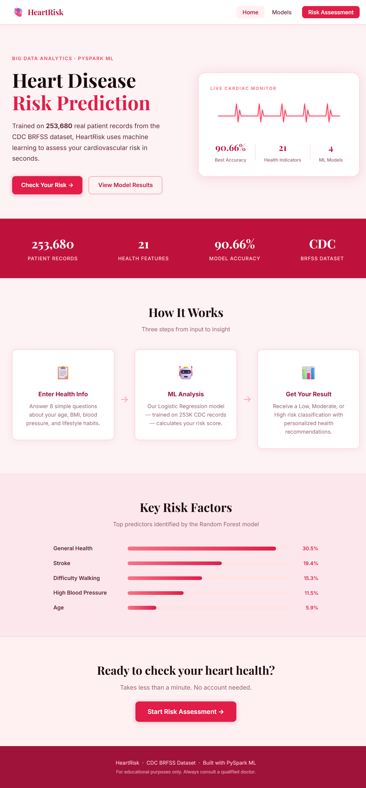
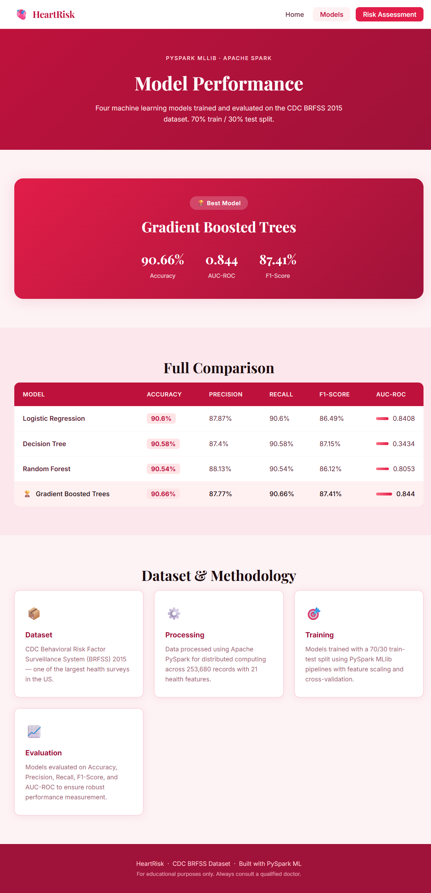
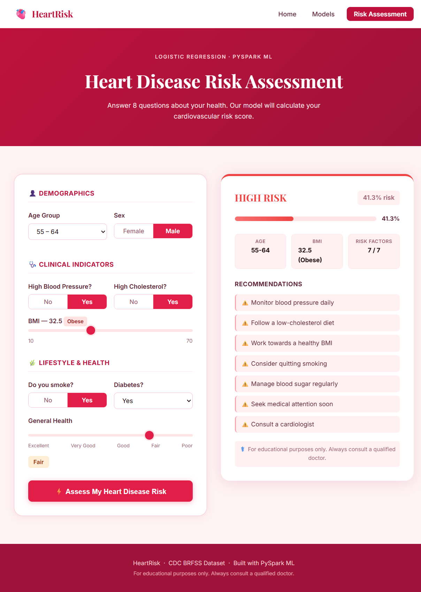

# 🫀 HeartRisk — Heart Disease Risk Predictor

A machine learning web application that predicts cardiovascular disease risk using real patient data from the CDC BRFSS 2015 dataset. Built with Apache PySpark MLlib for distributed model training and Flask for the web interface.

---

## 🚀 Live Demo

👉 **[Try HeartRisk Live](https://heart-disease-predictor-lggx.onrender.com)**

> Note: First load may take 30–50 seconds as the free server wakes up.

You can also run it locally on your system — see the **How to Run Locally** section below.

---

## 📸 Screenshots

| Home | Models | Risk Assessment |
|------|--------|----------------|
|  |  |  |

---

## 🧠 About the Project

Heart disease is one of the leading causes of death worldwide. This project uses Big Data Analytics and Machine Learning to assess a person's cardiovascular risk based on 8 simple health inputs.

We trained and compared **4 machine learning models** on **253,680 patient records** using Apache PySpark MLlib and deployed the best-performing model as an interactive web app.

---

## 📊 Dataset

- **Source:** CDC Behavioral Risk Factor Surveillance System (BRFSS) 2015
- **Records:** 253,680 patient entries
- **Features:** 21 health indicators
- **Target:** Binary classification — Heart Disease (Yes / No)

---

## 🤖 Models Trained

| Model | Accuracy | Precision | Recall | F1-Score | AUC-ROC |
|-------|----------|-----------|--------|----------|---------|
| Logistic Regression | 90.60% | 87.87% | 90.60% | 86.49% | 0.8408 |
| Decision Tree | 90.58% | 87.40% | 90.58% | 87.15% | 0.3434 |
| Random Forest | 90.54% | 88.13% | 90.54% | 86.12% | 0.8053 |
| **Gradient Boosted Trees** | **90.66%** | **87.77%** | **90.66%** | **87.41%** | **0.8440** |

> ✅ Best Model: **Gradient Boosted Trees** — 90.66% Accuracy, AUC-ROC: 0.844

---

## ⚙️ Tech Stack

| Layer | Technology |
|-------|-----------|
| Data Processing | Apache PySpark |
| ML Training | PySpark MLlib |
| Backend | Python, Flask |
| Frontend | HTML, CSS |
| Deployment | Render |
| Dataset | CDC BRFSS 2015 |

---

## 📁 Project Structure

```
HeartRisk/
├── app.py                       # Flask backend & prediction logic
├── requirements.txt             # Python dependencies
├── templates/
│   ├── base.html                # Shared navbar & footer
│   ├── home.html                # Landing page
│   ├── models.html              # Model comparison page
│   └── risk.html                # Risk assessment form
├── static/
│   └── css/
│       └── style.css            # Rose theme stylesheet
├── screenshots/
│   ├── home.png
│   ├── models.png
│   └── risk.png
└── models/
    ├── lr_model.pkl             # Trained Logistic Regression model
    ├── results_df.pkl           # Model comparison results
    └── feature_importances.pkl  # Feature importance scores
```

---

## 🖥️ How to Run Locally

**1. Clone the repository**
```bash
git clone https://github.com/devapriyaks15-netizen/heart-disease-predictor.git
cd heart-disease-predictor
```

**2. Install dependencies**
```bash
pip install -r requirements.txt
```

**3. Run the app**
```bash
python app.py
```

**4. Open in browser**
```
http://127.0.0.1:5000
```

---

## 🔍 Features

- **Home Page** — Project overview, key stats, ECG animation, top risk factors
- **Model Results** — Full comparison table of all 4 trained models
- **Risk Assessment** — Live prediction tool with 8 health inputs, instant risk score, and personalized recommendations

---

## 👥 Team

| Name | GitHub |
|------|--------|
| Deva Priya K S | [@devapriyaks15-netizen](https://github.com/devapriyaks15-netizen) |
| Duvur Mokshitha Aishwarya | [@mokshithaaish](https://github.com/mokshithaaish) |

---

## 🏫 Academic Context

- **Institution:** REVA University, Bengaluru
- **Department:** B.Tech Computer Science & Information Technology

---

## ⚕️ Disclaimer

This tool is for **educational purposes only**. It is not a substitute for professional medical advice. Always consult a qualified doctor for medical decisions.

---

## 📄 License

This project is open source and available under the [MIT License](LICENSE).
